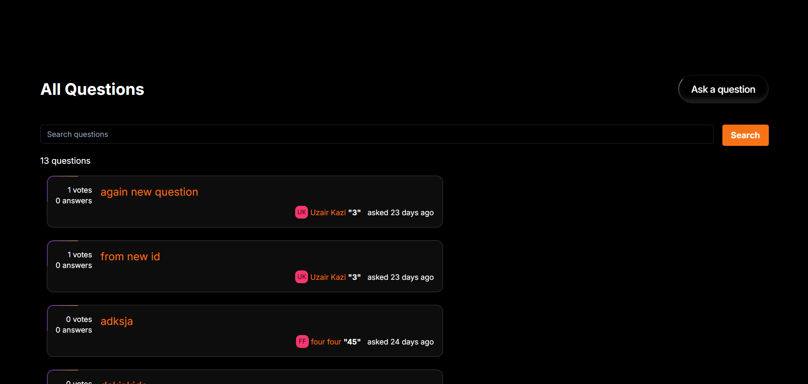

# Riverflow

This project is a Q&A platform for developers to ask questions, provide answers, and participate in the community by upvoting or downvoting responses. Inspired by StackOverflow, this platform is designed with simplicity, speed, and an intuitive user experience in mind.


## Features

- **Ask Questions**: Developers can post questions on various programming topics.
- **Answer Questions**: Community members can contribute by providing answers.
- **Voting System**: Users can upvote or downvote questions and answers based on their quality.
- **Tagging**: Questions can be tagged with relevant keywords to make them easily searchable.
- **User Authentication**: Secure user sign-up and login functionality.
- **User Profiles**: Each user has a profile that displays their activity, such as questions asked, answers given, and their reputation.
- **Search Functionality**: A powerful search feature to help users quickly find questions based on keywords or tags.
- **Real-time Updates**: Live updates for new questions, answers, and votes.
- **Responsive Design**: Fully responsive, works seamlessly on desktops, tablets, and mobile devices.


## Screenshots





## Tech Stack

- **Frontend**: Next.js, Typescript, TailwindCSS, ShadCN
- **Backend**: Appwrite (Backend-as-a-Service)
- **State Management**: Zustand
- **Deployment**: Vercel


## Run Locally

Clone the project

```bash
  git clone https://github.com/Uzairkazi695/stackoverflow-appwrite
```

Go to the project directory

```bash
  cd stackoverflow-appwrite

```

Install dependencies

```bash
  npm install
```

Set up environment variables


Start the server

```bash
  npm run dev
```


## Environment Variables

To run this project, you will need to add the following environment variables to your .env file

`NEXT_PUBLIC_APPWRITE_HOST_URL`

`NEXT_PUBLIC_APPWRITE_PROJECT_ID` 

`APPWRITE_API_KEY`


## Roadmap

- Notifications: Real-time notifications for new answers or comments.

- Social Sharing: Allow users to share questions or answers via social media.


## Contributing

Contributions are always welcome!


## License

This project is licensed under the [MIT](https://choosealicense.com/licenses/mit/) License.

